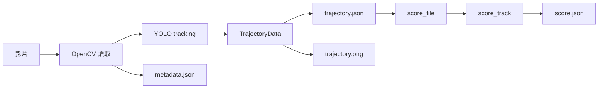
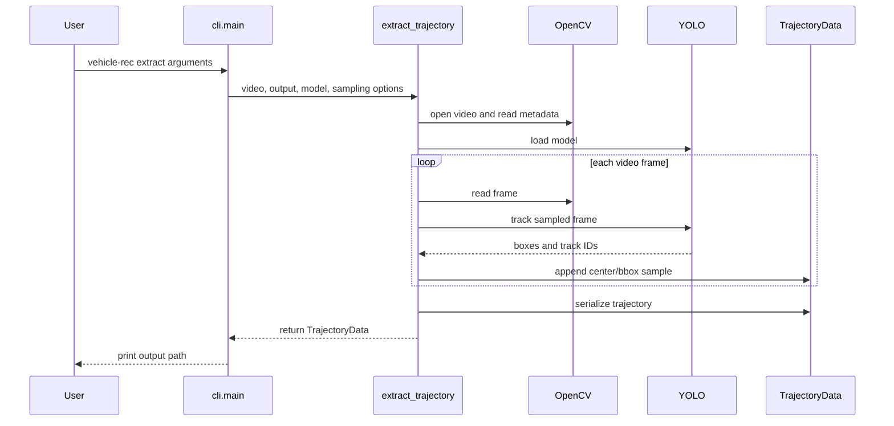
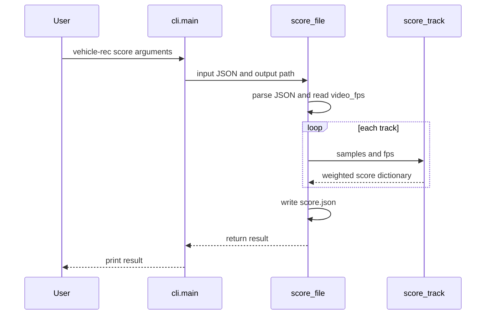

# Vehicle Recognition System 系統架構介紹

## 1. 系統定位

這是一個以 Python 建立的分階段遙控甩尾影片分析系統。核心設計是把「需要執行模型的影片抽取」與「只使用既有資料的評分」分開：



這種拆分讓評分權重可以調整而不必重新跑影片模型，也讓評分器可以單獨測試。

## 2. 專案結構與責任

```text
pyproject.toml                         建置、依賴、CLI entry point、pytest 設定
README.md                              專案摘要與快速開始
src/vehicle_rec_system/
├── __init__.py                        Python package 標記
├── cli.py                             命令列解析與流程分派
├── models.py                          資料結構定義
├── trajectory.py                      影片讀取、YOLO tracking、軌跡輸出
├── annotation.py                      影片多邊形標註與 YOLO segmentation dataset
├── training.py                        YOLO segmentation 訓練入口
├── zones.py                           跑道模型結果與車輛位置判定
└── scoring.py                         純資料評分與評分檔案輸出
tests/test_scoring.py                  評分器的基本行為測試
```

## 3. 封裝與安裝設定

### `pyproject.toml`

- `[build-system]` 使用 setuptools，要求 `setuptools>=68`。
- `[project]` 宣告套件名稱 `vehicle-rec-system`、版本 `0.1.0` 與 Python `>=3.11`。
- `dependencies` 安裝 NumPy、OpenCV 與 Ultralytics。
- `[project.scripts]` 將命令 `vehicle-rec` 綁定到 `vehicle_rec_system.cli:main`。
- `[tool.setuptools.packages.find]` 指示 setuptools 從 `src` 目錄尋找套件。
- `[tool.pytest.ini_options]` 將測試目錄設定為 `tests`。

安裝後，執行 `vehicle-rec` 等同於呼叫 `cli.py` 的 `main()`。

## 4. 資料模型：`models.py`

### `Detection`

```python
@dataclass
class Detection:
    frame: int
    time_seconds: float
    track_id: int
    bbox: list[int]
    center: list[int]
    angle_degrees: float | None = None
```

這個 dataclass 描述單筆偵測應有的欄位：frame 編號、時間、追蹤 ID、外框、中心點與可選角度。

目前它只被定義，`trajectory.py` 沒有實際建立 `Detection` 實例，而是直接建立普通 dictionary。這表示它是預留的資料契約，尚未成為執行時的強制型別。

### `TrajectoryData`

```python
@dataclass
class TrajectoryData:
    video_fps: float
    frame_width: int
    frame_height: int
    sample_frames: int
    tracks: dict[str, list[dict[str, Any]]] = field(default_factory=dict)
```

- 前四個欄位保存影片與抽樣設定。
- `tracks` 以字串 track ID 為 key。
- 每個 key 對應按讀取順序排列的樣本 dictionary 陣列。
- `field(default_factory=dict)` 避免不同物件共享同一個可變字典。

### `TrajectoryData.to_dict()`

這個方法將 dataclass 轉成可交給 `json.dumps()` 的 dictionary。它不會額外驗證資料，也不會把 `Detection` 物件轉換成字典，因為目前 `tracks` 內本來就是普通 dictionary。

## 5. CLI：`cli.py`

### 匯入

```python
import argparse
from pathlib import Path
from .scoring import score_file
from .trajectory import extract_trajectory
```

- `argparse` 負責命令列介面。
- `Path` 用於顯示絕對輸出路徑。
- `score_file` 與 `extract_trajectory` 是兩個實際工作入口。

### `main()` 的 parser

```python
parser = argparse.ArgumentParser(description="RC drift trajectory system")
subcommands = parser.add_subparsers(dest="command", required=True)
```

建立主 parser，並要求使用者必須選擇子命令。沒有命令時 argparse 會顯示錯誤。

### `extract` 子命令

它宣告：

- `--video`：必要字串。
- `--output`：必要字串。
- `--model`：必要字串。
- `--sample-frames`：整數，預設 5。
- `--vehicle-class`：整數，預設 0。

解析後會呼叫：

```python
extract_trajectory(
    args.video,
    args.output,
    args.model,
    args.sample_frames,
    args.vehicle_class,
)
```

呼叫完成後輸出解析後的絕對輸出資料夾位置。

### `score` 子命令

它宣告兩個必要字串：

- `--trajectory`：輸入 JSON 路徑。
- `--output`：輸出分數 JSON 路徑。

接著呼叫 `score_file()`，並把回傳的 dictionary 印到標準輸出。

### 模組入口

```python
if __name__ == "__main__":
    main()
```

因此既可透過安裝後的 `vehicle-rec` 執行，也可透過 `python -m vehicle_rec_system.cli` 執行。

## 6. 軌跡抽取：`trajectory.py`

`annotation.py` 提供 `annotate_video()`，以 OpenCV 顯示抽樣 frame，將滑鼠點擊組成多邊形，並寫入 YOLO segmentation 格式的 `images/train`、`labels/train` 與 `data.yaml`。跑道標註使用三個類別：`wall`、`track`、`score_zone`；車輛標註使用單一 `vehicle` 類別。

`training.py` 的 `train_segmentation_model()` 載入 Ultralytics segmentation base model，呼叫 `model.train()`，並回報 `weights/best.pt` 是否產生。CLI 以 `track-train` 和 `vehicle-train` 分別呼叫同一個訓練入口。

`zones.py` 將 segmentation 結果按 class ID 分組，使用 `cv2.pointPolygonTest()` 判斷車輛中心點是否在跑道、得分區或護欄多邊形內。

### 6.1 函式介面

```python
def extract_trajectory(
    video_path: str | Path,
    output_dir: str | Path,
    model_path: str,
    sample_frames: int = 5,
    vehicle_class: int | None = 0,
) -> TrajectoryData:
```

輸入是影片路徑、輸出資料夾、模型路徑與兩項抽樣設定，回傳記憶體中的 `TrajectoryData`。

### 6.2 輸出資料夾與影片開啟

```python
output = Path(output_dir)
output.mkdir(parents=True, exist_ok=True)
capture = cv2.VideoCapture(str(video_path))
```

- 將輸出路徑標準化成 `Path`。
- 自動建立不存在的資料夾及父資料夾。
- 用 OpenCV 建立影片擷取器。

若 `capture.isOpened()` 為 false，立即丟出 `ValueError`，不會繼續載入模型。

### 6.3 影片 metadata 與抽樣設定

```python
fps = capture.get(cv2.CAP_PROP_FPS) or 30.0
width = int(capture.get(cv2.CAP_PROP_FRAME_WIDTH))
height = int(capture.get(cv2.CAP_PROP_FRAME_HEIGHT))
data = TrajectoryData(fps, width, height, max(1, sample_frames))
```

- 讀取影片 FPS；如果回傳 0 或其他 falsy 值，使用 30 FPS。
- 讀取影片寬高並轉成整數。
- `sample_frames` 最小被修正為 1，避免取模運算使用 0。

### 6.4 模型與繪圖畫布

```python
model = YOLO(model_path)
canvas = np.zeros((height, width, 3), dtype=np.uint8)
frame_index = 0
```

- `YOLO(model_path)` 載入 Ultralytics 模型。
- 建立與影片同尺寸的黑色 BGR 畫布。
- frame 計數器從 0 開始，讀到一個 frame 後才加 1。

### 6.5 主讀取迴圈

```python
while True:
    ok, frame = capture.read()
    if not ok:
        break
    frame_index += 1
    if frame_index % data.sample_frames:
        continue
```

逐 frame 讀取直到影片結束。只有 `frame_index` 可以被抽樣間隔整除的 frame 才進入模型推論。因此 `sample_frames=5` 時會處理第 5、10、15... 個 frame。

### 6.6 YOLO tracking

```python
classes = None if vehicle_class is None else [vehicle_class]
result = model.track(frame, persist=True, classes=classes, verbose=False)[0]
```

- `vehicle_class=None` 代表不指定類別篩選。
- 其他值會包成單元素 list，僅追蹤該 class。
- `persist=True` 要求 tracker 在不同 frame 間保留追蹤狀態，使同一物件可以獲得持續的 track ID。
- `[0]` 取出目前單張 frame 對應的第一個結果。

若結果沒有 bounding boxes，或 boxes 沒有 tracker ID，就跳過該 frame：

```python
if result.boxes is None or result.boxes.id is None:
    continue
```

### 6.7 外框轉換與軌跡樣本

```python
boxes = result.boxes.xyxy.cpu().numpy().astype(int)
track_ids = result.boxes.id.int().cpu().numpy()
```

將模型 tensor 搬到 CPU、轉成 NumPy，再將座標轉成整數。

每個偵測接著執行：

1. 解構 `[x1, y1, x2, y2]`。
2. 計算整數中心點 `[(x1+x2)//2, (y1+y2)//2]`。
3. 建立包含 frame、時間、track ID、外框與中心點的 dictionary。
4. 用字串化的 track ID 作為 `data.tracks` key。
5. 將樣本 append 到該 track 的陣列。

時間欄位使用 `frame_index / fps`，不是從 0 起算的 `(frame_index - 1) / fps`。

### 6.8 軌跡視覺化

同一 track 累積兩個以上的點後，程式會在畫布上連接前一點與目前點：

```python
cv2.line(canvas, previous_center, current_center, (0, 220, 255), 3)
cv2.circle(canvas, current_center, 5, (0, 255, 0), -1)
```

OpenCV 使用 BGR，因此：

- `(0, 220, 255)` 顯示為黃色系線段。
- `(0, 255, 0)` 顯示為綠色圓點。
- 線寬為 3，圓點半徑為 5。

### 6.9 資源釋放與檔案輸出

讀取迴圈結束後呼叫 `capture.release()`。

接著寫出：

1. `trajectory.json`：`data.to_dict()` 的 JSON。
2. `metadata.json`：影片路徑、FPS、寬高與原始 `sample_frames` 參數。
3. `trajectory.png`：黑色畫布上的軌跡。

函式最後回傳 `data`。

## 7. 評分：`scoring.py`

### 7.1 權重

```python
WEIGHTS = {
    "route": 40.0,
    "angle": 20.0,
    "speed": 10.0,
    "speed_stability": 10.0,
    "angle_stability": 20.0,
}
```

權重總和為 100。這個 dictionary 同時用於計算和寫入輸出檔案，因此輸出會保留當次評分使用的權重。

### 7.2 `_angle_delta()`

```python
def _angle_delta(first, second):
    return abs((first - second + 180.0) % 360.0 - 180.0)
```

這是圓形角度的最短差值計算。它避免直接相減造成 0 度與 359 度被判定為 359 度差距。

### 7.3 `score_track()` 輸入與短資料處理

```python
def score_track(samples, fps):
```

函式接收單一 track 的樣本陣列與影片 FPS。

若樣本少於兩筆，無法計算位移，直接回傳所有項目與 `total` 都為 0：

```python
return {key: 0.0 for key in (*WEIGHTS, "total")}
```

### 7.4 速度與角度觀測值

程式使用相鄰樣本配對：

```python
for previous, current in zip(samples, samples[1:]):
```

每一對樣本：

- 計算 frame 差；若小於或等於 0，跳過。
- 取中心點的 `dx` 與 `dy`。
- 用 `math.hypot(dx, dy)` 計算像素距離。
- 乘以 `fps / frame_delta` 得到像素/秒近似速度。
- 用 `atan2(dy, dx)` 得到移動方向，並以 `% 360` 正規化。
- 若目前樣本有 `angle_degrees`，才把車輛角度與移動方向的最短差加入 `angles`。

注意：`trajectory.py` 目前沒有寫入 `angle_degrees`，所以由抽取器產出的原始 JSON 通常不會產生任何角度觀測值。

### 7.5 統計值

```python
speed_mean = mean(speeds) if speeds else 0.0
speed_variation = pstdev(speeds) if len(speeds) > 1 else 0.0
angle_variation = pstdev(angles) if len(angles) > 1 else 0.0
```

- `speed_mean` 是平均像素速度。
- `speed_variation` 是速度的母體標準差。
- `angle_variation` 是角度差的母體標準差。
- 沒有足夠資料時，變異量設為 0。

### 7.6 各項分數

路線：

```python
"route": WEIGHTS["route"]
```

只要 track 有至少兩個樣本，就直接給 40 分。這不是幾何路線品質分析。

角度：

```python
min(20, mean(angles) / 45 * 20)
```

目前實作是「角度差越大，分數越高」，並在 20 分封頂。若沒有角度資料，為 0。

速度：

```python
min(10, speed_mean / 100 * 10)
```

平均速度達到 100 像素/秒時取得 10 分；速度更高也不超過 10 分。

速度穩定度：

```python
max(0, 10 * (1 - speed_variation / max(speed_mean, 1)))
```

速度變異越大，分數越低；結果不低於 0。當沒有足夠速度變異資料時，會得到滿分 10。

角度穩定度：

```python
max(0, 20 * (1 - angle_variation / 45))
```

角度差變異越大，分數越低；結果不低於 0。當沒有角度或只有一筆角度觀測時，`angle_variation` 是 0，因此穩定度會是 20 分。

總分：

```python
result["total"] = min(100.0, max(0.0, sum(result.values())))
```

把五項分數加總後限制在 0 到 100，再將所有欄位四捨五入到小數點後兩位。

### 7.7 `score_file()`

```python
data = json.loads(Path(input_path).read_text(encoding="utf-8"))
```

讀取並解析軌跡 JSON。接著對 `tracks` 中每個 track 呼叫 `score_track(samples, data["video_fps"])`。

輸出結構為：

```python
result = {"weights": WEIGHTS, "tracks": scores}
```

最後以 UTF-8、`ensure_ascii=False`、縮排 2 格寫入指定輸出路徑，並回傳同一個 dictionary 給 CLI 印出。

## 8. 測試：`tests/test_scoring.py`

目前測試建立三個樣本：

- frame 0，中心點 `[0, 0]`
- frame 5，中心點 `[50, 0]`
- frame 10，中心點 `[100, 0]`

並以 `fps=30` 呼叫 `score_track()`，確認：

- `total` 在 0 到 100 之間。
- `route` 是 40 分。
- `angle` 存在且不小於 0。

這是基本的 bounded-score regression test，尚未覆蓋影片讀取、模型推論、JSON 輸出、空 track、無角度資料、frame 順序錯誤或 CLI 端到端流程。

## 9. 端到端資料流

### 9.1 `extract`



### 9.2 `score`



## 10. 已知架構限制與風險

1. `Detection` dataclass 尚未被抽取流程使用，資料模型與實際資料建立方式有兩套。
2. 抽取流程沒有計算或保存 `angle_degrees`，角度評分無法由標準抽取流程提供。
3. `route` 目前固定給分，沒有跑道、邊界、漂移區段或路線品質模型。
4. `metadata.json` 使用原始 `sample_frames` 參數，但 `TrajectoryData` 使用 `max(1, sample_frames)` 後的值；輸入 0 或負數時兩者可能不一致。
5. 影片讀取器與 YOLO 模型沒有使用 `try/finally` 包住整個推論流程；若模型或寫檔中途發生例外，影片資源不一定會走到 `release()`。
6. `score_file()` 對輸入 JSON 的必要欄位沒有顯式驗證，格式錯誤會以 Python 的 `KeyError`、`JSONDecodeError` 或檔案例外呈現。
7. CLI 沒有設定 logging、進度顯示或錯誤訊息格式化；長影片執行時使用者只能等待模型處理。
8. 測試目前集中在評分器，尚未建立抽取器與 CLI 的整合測試。

## 11. 建議的後續演進方向

若要擴充系統，建議依以下邊界進行：

1. 讓 `trajectory.py` 建立 `Detection`，並集中 JSON 序列化規則。
2. 增加姿態、外框方向或光流估計，以產生可靠的 `angle_degrees`。
3. 將跑道資訊抽成獨立的 `zones.py` 或 route scorer，避免把幾何規則塞進基本評分器。
4. 為 `score_track()` 增加各評分項目的單元測試，尤其是角度環繞、零速度與異常 frame 順序。
5. 增加 CLI 端到端測試，驗證輸出檔名、JSON schema 與錯誤行為。
6. 使用 `try/finally` 管理 `VideoCapture`，並加入抽取進度與結構化錯誤訊息。
